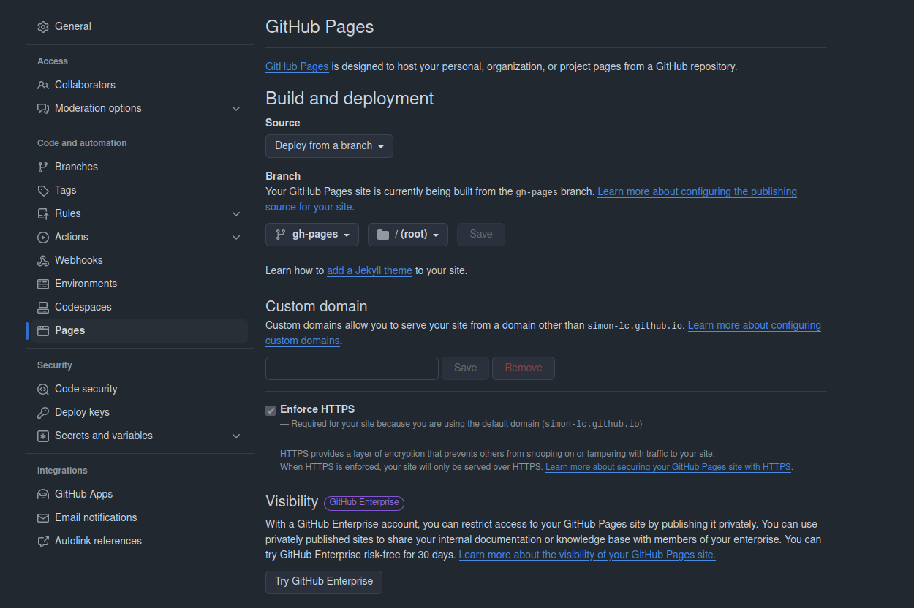

# Building documentation

## Github pages deployment setting
Use the following settings for the Github pages deployment:



## Building locally
Go to package root
```
cd ~/framecat
```

Create a virtual environment `.docs_venv`
```
python -m venv .docs_venv
source .docs_venv/bin/activate
```

Install documentation dependencies
```
pip install uv
uv pip install --system -r docs/requirements.txt
```

Build the documentation
```
sphinx-build docs/source docs/build -b dirhtml
```

To fail when there is a warning, you can add the `-W` flag
```
sphinx-build docs/source docs/build -W -b dirhtml
```

Serve the documentation locally
```
python -m http.server --directory docs/build 8000
```

Clean up built documentation
```
rm -rf docs/build
```
